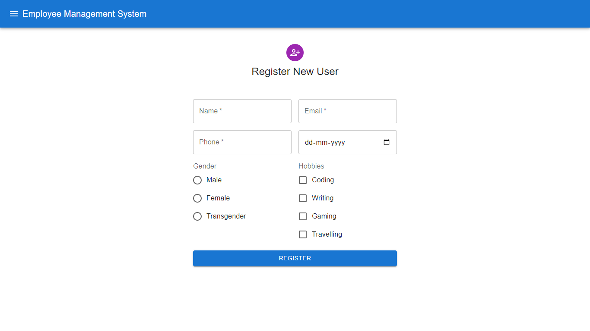
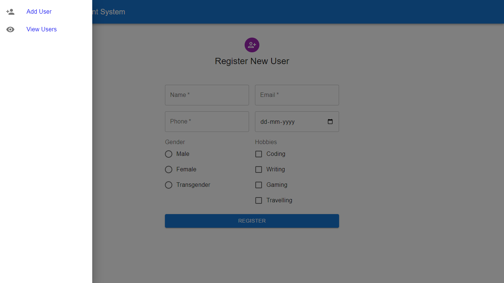
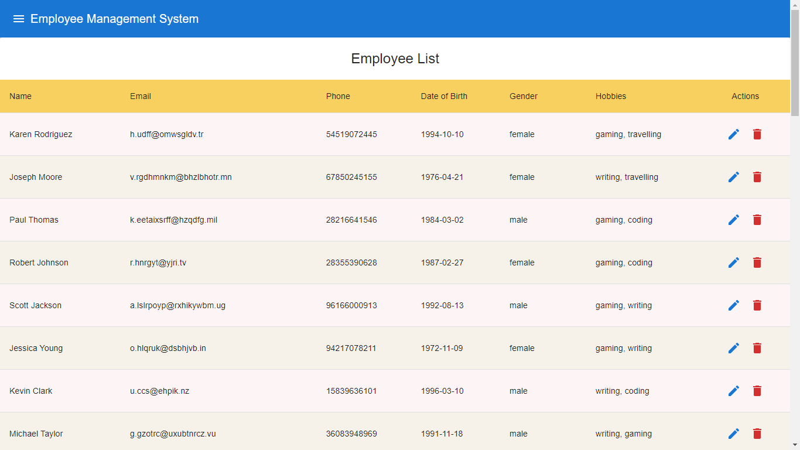
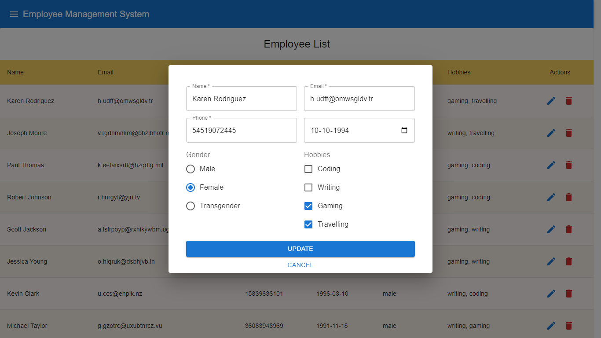
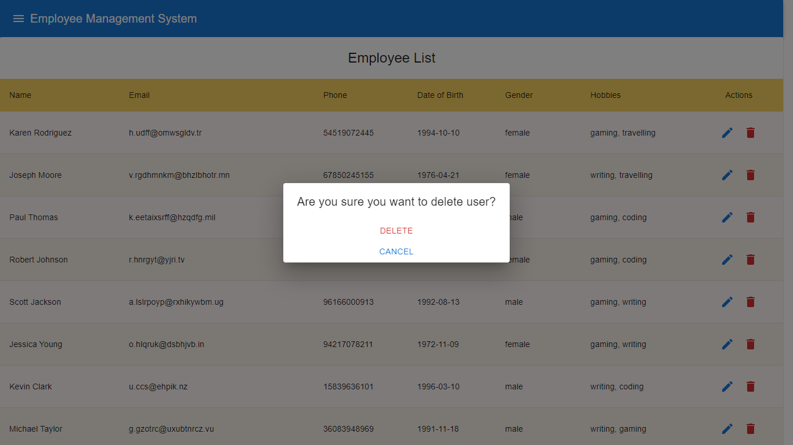

# Employee Management System

This project is an Employee Management System that allows users to perform CRUD operations on employee data.

### Technologies Used

- React.js
- Material UI
- JSON Server
- MockJs

## Installation

1. Clone the repository: git clone <_repository-url_>
2. Install the dependencies: npm install

## Usage

1. Start the JSON server: npm run server
2. Start the React app: npm start
3. Open the web application in your browser: http://localhost:3000

## Features

- Create, read, update, and delete employee data
- Material form controls for input fields and modals
- Material data table for displaying employee data
- Integration with fake backend server using JSON Server and Mock.js

## ScreenShots

#### Add New Employee

#### Routing

#### Employee Lists

#### Update employee modal

#### Delete employee popup

### Deployed Backend

https://emsystem.vercel.app/

### Deployed Frontend

https://emsystem.glitch.me/
